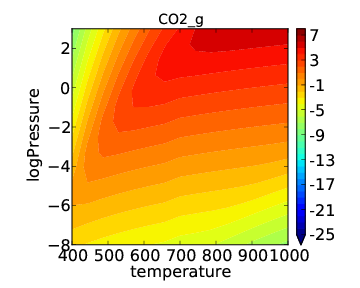

Using Thermodynamic Descriptors 
================================

The previous tutorials have explained how to create a kinetic model which uses
binding energies of key intermediates as "descriptors" in order to create a
"map" of catalytic activity across different types of surfaces. This type of
analysis is useful for catalyst screening, but it is also often interesting to
take a closer look at a single catalyst surface and explore the effect of
reaction conditions. In order to do this in CatMAP we will use the same
framework as discussed in the :doc:`code_overview`. The only difference is
that instead of using energies as descriptors we will use "thermodynamic
variables" (temperature, pressure for now) as descriptors. Naturally this also
means that we will need to use a different "scaler" which, instead of creating
a linear map uses some pre-defined expressions to add in the proper free energy
contributions.

To make this clearer we will continue with the CO oxidation example and examine
CO oxidation on Pt(111) as a function of temperature and pressure. Again, the
purpose is not to make a publishable analysis but to become familiar with the
functionality of CatMAP. We will be able to use a "submission script"
(mkm_job.py) very similar to the one from 
:doc:`../tutorials/refining_a_microkinetic_model`.

.. code-block:: python

    from catmap import ReactionModel

    mkm_file = 'CO_oxidation.mkm'
    model = ReactionModel(setup_file=mkm_file)
    model.output_variables += ['production_rate'] model.run()

    from catmap import analyze 

    vm = analyze.VectorMap(model) 
    vm.plot_variable = 'production_rate' 

    #tell the model which output to plot 

    vm.log_scale = True #rates should be plotted on a log-scale 
    vm.min = 1e-25 #minimum rate to plot
    vm.max = 1e3 #maximum rate to plot 
    vm.threshold = 1e-25 #anything below this is considered to be 0 
    vm.subplots_adjust_kwargs = {'left':0.2,'right':0.8,'bottom':0.15} 
    vm.plot(save='production_rate.pdf')

For simplicity we will only look at the "production_rate" output variable in
this tutorial. Other outputs can be calculated/analyzed as described in
tutorials 2-3, :doc:`../tutorials/creating_a_microkinetic_model`
and :doc:`../tutorials/refining_a_microkinetic_model`.

We will use a reaction model similar to the simple one used in
:doc:`../tutorials/creating_a_microkinetic_model` since this will run faster
than the more complicated models. In order to refine this to something more
sophisticated you can follow the strategy outlined in
:doc:`../tutorials/refining_a_microkinetic_model`. This also means that we can
re-use the energies.txt file from
:doc:`../tutorials/creating_a_microkinetic_model`, although we can make it even
shorter since we only care about the Pt(111) energies:

.. code::

    surface_name	site_name	species_name	formation_energy	bulk_structure	frequencies	other_parameters	reference
    None	gas	CO2	2.45	None	[1333,2349,667,667]	[]	"Angew. Chem. Int. Ed., 47, 4835 (2008)"
    None	gas	CO	2.74	None	[2170]	[]	"Energy Environ. Sci., 3, 1311-1315 (2010)"
    None	gas	O2	5.42	None	[1580]	[]	Falsig et al (2012)
    Pt	111	O	1.62	fcc	[]	[]	Falsig et al (2012)
    Pt	111	CO	1.7	fcc	[]	[]	"Angew. Chem. Int. Ed., 47, 4835 (2008)"
    Pt	111	O-CO	4.04	fcc	[]	[]	"Angew. Chem. Int. Ed., 47, 4835 (2008)"
    Pt	111	O-O	5.35	fcc	[]	[]	Falsig et al (2012)

Note that we could also leave all the other energies in since the parser will
just ignore any lines it doesn't need. Finally, there is the "setup file" -
CO_oxidation.mkm. This is where all of the necessary changes must be made in
order to use "thermodynamic descriptors". We will start with the same setup
file from :doc:`../tutorials/creating_a_microkinetic_model`, but we need to make
the following changes:

- Change the scaler Add the following line somewhere in the setup file
  (usually near the beginning): :code:`scaler = 'ThermodynamicScaler'` As
  you can probably guess this tells CatMAP to use the "ThermodynamicScaler" class
  to move from "descriptor space" to "parameter space" (see
  :doc:`code_overview`). This class will use whatever "thermo modes" are defined
  for gas phase/adsorbate species in order to add free energy contributions (see
  :doc:`../tutorials/creating_a_microkinetic_model`).

- Choose the relevant surface Next we need to tell CatMAP which surface to
  use. For this example we will look at Pt(111). To do this we just need to
  change the "surface_names" variable:

  .. code:: python

    surface_names = ['Pt'] 
    
  Note that the (111) surface is already selected due to the line:

  .. code:: python
  
    species_definitions['s'] = {'site_names': ['111'], 'total':1}

- Change the descriptors Now we need to tell the "ThermodynamicScaler" which
  two variables we will be using for descriptors, and we need to modify the
  ranges over which to vary these descriptors. Currently only temperature and
  pressure are implemented, although there is also an option to use log(pressure)
  as discussed later. For now lets look at temperatures from 400 - 1000 K and
  pressures from 1e-8 to 1000 bar:
  
  .. code:: python

    descriptor_names= ['temperature','pressure'] 
    descriptor_ranges = [[400,1000],[1e-8,1e3]]

- Modify temperature/pressure to be compatible - In
  :doc:`../tutorials/creating_a_microkinetic_model`) we used a model where
  temperature and pressure were explicitly specified. This doesn't really make
  sense now, since we are varying these two variables. The temperature ends up
  not really mattering since it will be over-written as CatMAP moves through
  descriptor space; however, just to be unambiguous its good practice to delete
  the following line:
  
  .. code:: python
  
    temperature = 500 #Temperature of the reaction

Finally, we need
to tell CatMAP how to handle the pressures. Previously we just defined "static
pressures" for each gas-phase species, but that doesn't make sense if the total
pressure is varying. In order to get around this we instead specify
"concentrations" for each gas-phase species:

.. code:: python

    species_definitions['CO_g'] = {'concentration':2./3.}
    species_definitions['O2_g'] = {'concentration':1./3.}
    species_definitions['CO2_g'] = {'concentration':0}

Note that this "concentration" is not normalized - the total pressure of a gas
at any total pressure will be given by concentration*P where P is the total
pressure. Thus, if the concentrations do not sum to 1 then the  "pressure" axis
will be incorrect.

After making these changes we can run the "submission script" with:

.. code:: bash

    sh python mkm_job.py 
    
which should give the usual kind of output. When it
finishes you should see the following "production_rate.pdf" in the folder:

.. figure:: ../_static/4_production_rate.png
    :width: 50 %
    :align: center

As expected, the temperature dependence is much more drastic than the pressure
dependence. In many cases it makes more sense to look at pressure dependence on
a log scale. This is easily achieved by changing the descriptor names/ranges:

.. code:: python

    descriptor_names= ['temperature','logPressure'] 
    descriptor_ranges = [[400,1000],[-8,3]]

Note that the "log" in this notation refers to a base 10 logarithm so that the
plot produced is the same as before, but with pressure on a log scale. If we
now run the submission script we get the following output:

This looks a little nicer than the previous plot since the low pressure
behavior has higher resolution.

We can see from this tutorial that it is fairly easy to move between a
micro-kinetic model for a screening study and one for a "reaction condition"
study (and vice-versa). Only a few lines of the "setup file" need to be
changed. This is one advantage of CatMAP - once you setup a reaction model once
you can re-use it for several different analyses.
