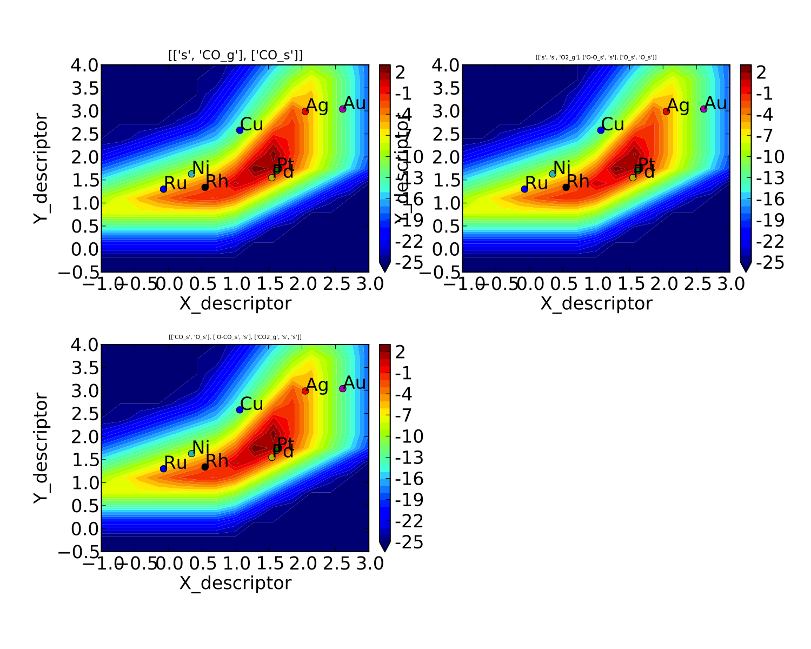
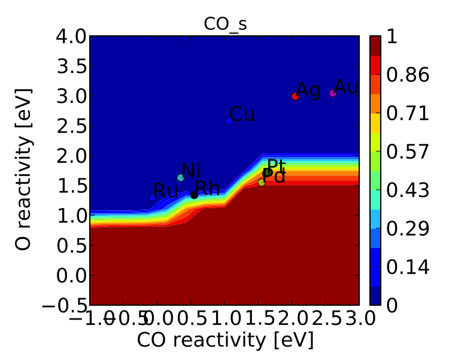

Creating a Microkinetic Model
=============================

This tutorial provides a walk-through of how to create a very basic
micro-kinetic model for CO oxidation on transition-metal (111) surfaces.
More advanced features are explored in :doc:`refining_a_microkinetic_model`
and the :doc:`../topics/index` section.

Setting up the model
--------------------

All micro-kinetic models require a minimum of 2 files: the "setup file"
and the "submission script". In addition it is almost always necessary
to specify an "input file" which is used by the "parser" to extend the
"setup file" (see :doc:`generating_an_input_file`).

Input File
~~~~~~~~~~

We will begin by assuming that the input file has already been generated
similar to :doc:`generating_an_input_file`. In fact these energies
were taken from `CatApp <http://suncat.stanford.edu/#/theory/outreach/catapp/>`__ and
compiled into a format compatible with CatMAP:

::

    surface_name    site_name   species_name    formation_energy    bulk_structure  frequencies other_parameters    reference
    None    gas CO2 2.45    None    [1333,2349,667,667] []  "Angew. Chem. Int. Ed., 47, 4835 (2008)"
    None    gas CO  2.74    None    [2170]  []  "Energy Environ. Sci., 3, 1311-1315 (2010)"
    None    gas O2  5.42    None    [1580]  []  "Falsig et al (2012)"
    Ru  111 O   -0.07   fcc []  []  "Falsig et al (2012)"
    Ni  111 O   0.35    fcc []  []  "Falsig et al (2012)"
    Rh  111 O   0.55    fcc []  []  "Falsig et al (2012)"
    Cu  111 O   1.07    fcc []  []  "Falsig et al (2012)"
    Pd  111 O   1.55    fcc []  []  "Falsig et al (2012)"
    Pt  111 O   1.62    fcc []  []  "Falsig et al (2012)"
    Ag  111 O   2.05    fcc []  []  "Falsig et al (2012)"
    Au  111 O   2.61    fcc []  []  "Falsig et al (2012)"
    Ru  111 CO  1.3 fcc []  []  "Angew. Chem. Int. Ed., 47, 4835 (2008)"
    Rh  111 CO  1.34    fcc []  []  "Angew. Chem. Int. Ed., 47, 4835 (2008)"
    Pd  111 CO  1.55    fcc []  []  "Angew. Chem. Int. Ed., 47, 4835 (2008)"
    Ni  111 CO  1.63    fcc []  []  "Angew. Chem. Int. Ed., 47, 4835 (2008)"
    Pt  111 CO  1.7 fcc []  []  "Angew. Chem. Int. Ed., 47, 4835 (2008)"
    Cu  111 CO  2.58    fcc []  []  "Angew. Chem. Int. Ed., 47, 4835 (2008)"
    Ag  111 CO  2.99    fcc []  []  "Angew. Chem. Int. Ed., 47, 4835 (2008)"
    Au  111 CO  3.04    fcc []  []  "Angew. Chem. Int. Ed., 47, 4835 (2008)"
    Ru  111 O-CO    2.53    fcc []  []  "Angew. Chem. Int. Ed., 47, 4835 (2008)"
    Rh  111 O-CO    3.1 fcc []  []  "Angew. Chem. Int. Ed., 47, 4835 (2008)"
    Ni  111 O-CO    3.25    fcc []  []  "Angew. Chem. Int. Ed., 47, 4835 (2008)"
    Pt  111 O-CO    4.04    fcc []  []  "Angew. Chem. Int. Ed., 47, 4835 (2008)"
    Cu  111 O-CO    4.18    fcc []  []  "Angew. Chem. Int. Ed., 47, 4835 (2008)"
    Pd  111 O-CO    4.2 fcc []  []  "Angew. Chem. Int. Ed., 47, 4835 (2008)"
    Ag  111 O-CO    5.05    fcc []  []  "Angew. Chem. Int. Ed., 47, 4835 (2008)"
    Au  111 O-CO    5.74    fcc []  []  "Angew. Chem. Int. Ed., 47, 4835 (2008)"
    Ag  111 O-O 5.98    fcc []  []  "Falsig et al (2012)"
    Au  111 O-O 7.22    fcc []  []  "Falsig et al (2012)"
    Cu  111 O-O 4.74    fcc []  []  "Falsig et al (2012)"
    Pt  111 O-O 5.35    fcc []  []  "Falsig et al (2012)"
    Rh  111 O-O 3.79    fcc []  []  "Falsig et al (2012)"
    Ru  111 O-O 3.34    fcc []  []  "Falsig et al (2012)"
    Pd  111 O-O 5.34    fcc []  []  "Falsig et al (2012)"

For this example we will name this file "energies.txt" and place it in
the same directory as the other files.

Setup File
~~~~~~~~~~

Next we will create the "setup file". Lets make a text file named
"CO\_oxidation.mkm". The suffix ".mkm" is often used to designate a
micro-kinetics module setup file, but it is not required.

One of the most important aspects of the "setup file" is the
"rxn\_expressions" variable which defines the elementary steps in the
model. For this simplified CO oxidation model we will specify these as:

.. code:: python

    rxn_expressions = [ 

                   '*_s + CO_g -> CO*', 
                   '2*_s + O2_g <-> O-O* + *_s -> 2O*',
                   'CO* +  O* <-> O-CO* + * -> CO2_g + 2*',

                       ]   

The first expression includes CO adsorption without any activation
barrier. The second includes an activated dissociative chemisorption of
the oxygen molecule, and the final is an activated associative
desorption of CO2. More complex models for CO oxidation could be
imagined, but these elementary steps capture the key features. Note that
we have only included ":code:`*`" and ":code:`*_s`" sites since this is a single-site
model for CO oxidation. This means that all intermediates will be
adsorbed at a site designated as ":code:`s`". These reaction expressions will be
parsed automatically in order to define the adsorbates,
transition-states, gasses, and surface sites in the model.

One important thing to note is that uses some subset of gas phase energies present
in your input file to generate a complete set of reference energies for every element
present in your reactions.  However, it can only use gas species present in your reaction
network.  If you'd like CatMAP to use a gas species that does not appear in your
reaction network as an atomic reference, you may need to add a dummy reaction like
":code:`H2O_g -> H2O_g`" (in the case of adding H2O gas) to ":code:`rxn_expressions`".

Next, we need to tell the model which surfaces we are interested in.

.. code:: python

    surface_names = ['Pt', 'Ag', 'Cu','Rh','Pd','Au','Ru','Ni'] 
    #surfaces to include in scaling (need to have descriptors defined for each)

Now we will tell the model which energies to use as descriptors:

.. code:: python

    descriptor_names= ['O_s','CO_s'] #descriptor names

The model also needs to know the ranges over which to check the
descriptors, and the resolution with which to discretize this range. It
is generally good to use a range which includes all metals of interest,
but doesn't go too far beyond. For this example we will use a relatively
low resolution (15) in order to save time.

.. code:: python

    descriptor_ranges = [[-1,3],[-0.5,4]]

    resolution = 15

This means that the model will be solved for each of 15 oxygen
adsorption energies between -1 and 3, for each of 15 CO adsorption
energies between -0.5 and 4 (a total of 225 points in descriptor space).

Next, we set the temperature of the model (in Kelvin):

.. code:: python

    temperature = 500

In the next part we will create and explicitly set some variables in the
":code:`species_definitions`" dictionary. This dictionary is the central place
where all species-specific information is stored, but for the most part
it will be populated by the "parser". However, there are a few things
that need to be set explicitly. First, the gas pressures:

.. code:: python

    species_definitions = {}
    species_definitions['CO_g'] = {'pressure':1.} #define the gas pressures
    species_definitions['O2_g'] = {'pressure':1./3.}
    species_definitions['CO2_g'] = {'pressure':0}

Next, we need to include some information about the surface site:

.. code:: python

    species_definitions['s'] = {'site_names': ['111'], 'total':1} #define the sites

This line tells the code that anything with ":code:`111`" in the ":code:`site_name`"
column of the input file has energetics associated with an "s" site.
This is a list because we might want to include multiple site\_names as
a single site type; for example, if we designated some sites as ":code:`fcc`"
and some as ":code:`ontop`", but both were on the (111) surface we might instead
use: ":code:`site_name:['fcc','ontop']`".

We also need to tell the model where to store the output. By default it
will create a data.pkl file which contains all the large outputs (those
which would take more than 100 lines to represent with text). Lets make
it store things in :code:`CO_oxidation.pkl` instead.

.. code:: python

    data_file = 'CO_oxidation.pkl'

This concludes the attributes which need to be set for the ReactionModel
itself; however, we probably want to specify a few more settings of the
"parser", "scaler", "solver", and "mapper".

For convenience, all variables are specified in the same file and same
format. Since we did not specify a parser, the default parser
(TableParser) will be used. This could be explicitly specified with
parser = 'TableParser' but this is not necessary. First we will tell the
parser where to find the input table that we saved earlier:

.. code:: python

    input_file = 'energies.txt'

Next, we need to tell the model how to add free energy corrections. For
this example we will use the Shomate equation for the gas
thermochemistry, and assume that the adsorbates have no free energy
contributions (since we don't have frequencies for them).

.. code:: python

    gas_thermo_mode = "shomate_gas"
    adsorbate_thermo_mode = "frozen_adsorbate"

There are a number of other approximations built into the model. For
example, gas-phase thermochemistry can be approximated by:

-  :code:`ideal_gas` - Ideal gas approximation (assumes that atoms are in
   ase.structure.molecule and that arguments for
   ase.thermochemistry.IdealGasThermo are specified in
   catmap.data.ideal_gas_params and that frequencies are provided)
-  :code:`shomate_gas` - Uses Shomate equation (assumes that Shomate
   parameters are defined in catmap.data.shomate_params)
-  :code:`fixed_entropy_gas` - Includes zero-point energy and a static
   entropy correction (assumes that frequencies are provided and that
   gas entropy is provided in catmap.data.fixed_entropy_dict (if not
   0.002 eV/K is used))
-  :code:`frozen_fixed_entropy_gas` - Same as :code:`fixed_entropy_gas` except
   that zero-point energy is neglected.
-  :code:`zero_point_gas` - Only includes zero-point energies and neglects
   entropy (assumes that frequencies are provided)
-  :code:`frozen_gas` - Do not include any corrections.

Similarly, adsorbate thermochemistry can be approximated by:

-  :code:`harmonic_adsorbate` - Use the harmonic approximation and assume all
   degrees of freedom are vibrational (implemented via
   ase.thermochemistry.HarmonicThermo and assumes that frequencies are
   defined)
-  :code:`zero_point_adsorbate` - Only includes zero-point energies (assumes
   frequencies are defined)
-  :code:`frozen_adsorbate` - Do not include any corrections.

The next thing we want to specify are some parameters for the scaler.
Since we have not explicitly specified a scaler the default
:doc:`GeneralizedLinearScaler <../reference/catmap.scalers>` will be used. This
scaler uses a coefficient matrix to map descriptor-space to parameter space and
will be discussed in more detail in a future tutorial. By default a numerical
fit will be made which minimizes the error by solving an over-constrained
least-squares problem in order to map the lower-dimensional "parameter
space" to the higher dimensional "descriptor space". However, this fit
is often unstable since fits are sometimes constructed with limited
input data. In order to reduce this instability we want to place
constraints on the coefficients so that adsorbates only scale with
certain descriptors, and we can also force coefficients to be positive,
negative, equal to a value, or in between certain values. We also need
to tell the scaler how to determine transition-state energies. In this
example we do this by:

.. code:: python

    scaling_constraint_dict = {
                               'O_s':['+',0,None],
                               'CO_s':[0,'+',None],
                               'O-CO_s':'initial_state',
                               'O-O_s':'final_state',
                               }

(note that the keys here include the adsorbate name and the site label
separated by an underscore \_ ) This means that for oxygen we force a
positive ('+') slope for descriptor 1 (oxygen binding), a slope of 0 for
descriptor 2 (CO binding), and we put no constraints on the constant.
This is equivalent to saying:

:math:`E_O = a * E_O + c`

where :math:`a` must be positive. Of course in this example its trivial to see
that :math:`a` should be 1 and :math:`c` should be 0 since of course :math:`E_O = E_O`. We
could specify this explicitly using :code:`'O_s':[1,0,0]`. We could also impose
other constraints:

-  :code:`'O_s':['-',0,None]` would force :math:`a` to be negative
-  :code:`'O_s':['0:3',0,None]` would force :math:`a` to be between 0 and 3
-  :code:`'O_s':[None,0,None]` would put no constraints on :math:`a`
-  :code:`'O_s':[None,None,None]` would let :math:`E_O = a*E_O + b*E_{CO} + c` with
   no constraints on :math:`a`, :math:`b`, or :math:`c`

and so on. By default the constraints would be :code:`['+','+',None]`. In this
case the algorithm will find the correct solution of :math:`a` = 1, :math:`c` = 0
even if the solution is unconstrained, but the constraints are still
specified to provide an example. We use similar logic for the CO
constraint since we know that it should depend on CO binding but not on
O binding.

We also need to tell the model how to handle the transition-state
scaling. We have three options:

-  :math:`E_{TS} = m*E_{IS}+n` (:code:`initial_state`)
-  :math:`E_{TS} = m*E_{FS} + n` (:code:`final_state`)
-  :math:`E_{TS} = m*\Delta E + n` (:code:`BEP`)

where :math:`E_{TS}` is the transition-state formation energy, :math:`E_{IS}` is the
intitial-state (reactant) energy, :math:`E_{FS}` is the final-state (product)
energy for the elementary step, and :math:`\Delta E` is the reaction energy of the
elementary step. By default :code:`initial_state` is used, but for some
elementary steps this might not make sense. The dissociative adsorption
of oxygen is a great example, since the initial state energy is equal to
the gas-phase energy of the oxygen molecule and is a constant. Thus, if
we assumed :code:`initial_state` scaling then we would be assuming a constant
activation energy which would obviously not capture trends across
surfaces. Instead, we scale with the ':code:`final_state`'.

By default the coefficients *m* and *n* are computed by a least-squares
fit. They can be accessed by the
"transition\_state\_scaling\_coefficients" attribute of the
ReactionModel after the model has been run. In some cases it may be
necessary to specify these coefficients manually because, for example,
the transition-state energies have not been calculated. This can be
achieved by using the values: 'initial\_state:[*m*,\ *n*]' or
:code:`initial_state:[m]` where ':code:`initial_state`' could also be
':code:`final_state`' or 'BEP'. If only *m* is specified then *n* will be
determined by a least-squared fit. It is worth noting here that while
*m* is independent of the reference used to compute the "generalized
formation energies" in the input file (see :ref:`formation_energy`), *n*
will depend on the references for ':code:`initial_state`' or ':code:`final_state`'
scaling. Thus if you are using transition-state scaling values from some
previously published work it is critical that the same reference sets be
used.

Now we need to set some parameters that will be used by the "solver". By
default the SteadyStateSolver is used. First, we tell the solver how
many decimals of precision we want to use:

.. code:: python

    decimal_precision = 100 #precision of numbers involved

While 100 digits of precision seems like overkill (and it actually is
here), it is often necessary to go above 50 digits due to the extreme
stiffness of the reaction expressions. Using 100 digits is a good rule
of thumb, and doesn't slow things down too much (especially if you have
`gmpy <http://code.google.com/p/gmpy/>`__ installed).

Next, we set the tolerance of the steady-state solutions:

.. code:: python

    tolerance = 1e-50 #all d_theta/d_t's must be less than this at the solution

The tolerance is the maximum allowed rate of change of surface species
coverages at the steady-state solution. This should be less than the
smallest rate you are interested in for the problem (i.e. the lower
bound of the rate "volcano plot") but should be well above the machine
epsilon at the given decimal\_precision (ca. 1e-100 in this case).

Finally, we set some practical variables controlling the number of
iterations allowed by the solver:

.. code:: python

    max_rootfinding_iterations = 100

    max_bisections = 3

The maximum rootfinding iterations controls the number of times Newton's
method iterations can be applied in the rootfinding algorithm, while the
maximum bisections tells the number of times the mapper can bisect
descriptor space when trying to move from one point to another. Note
that the maximum number of intermediate points between two points in
descriptor space is 2\ :sup:`max\_bisections` so increasing this number
can slow the code down considerably. In this particular example
convergence is very easy and neither of these limits will ever be
reached, but we set them here for reference.

Submission Script
~~~~~~~~~~~~~~~~~

Now the hard part is done and we just need to run the model. Save the
CO\_oxidation.mkm file and create a new file called "mkm\_job.py". This
will be the submission script.

.. code:: python

    from catmap import ReactionModel

    mkm_file = 'CO_oxidation.mkm'
    model = ReactionModel(setup_file=mkm_file)
    model.run()

If we run this file with "python mkm\_job.py" then the output should
look something like:

::

    >> mapper_iteration_0: status - 100 points do not have valid solution.
    >> minresid_iteration_0: success - [ 3.00, 4.00] using coverages from [ 3.00, 4.00]
    >> minresid_iteration_0: success - [ 3.00, 3.50] using coverages from [ 3.00, 3.50]
    >> ...
    >> ...
    >> ...
    >> minresid_iteration_0: success - [-1.00, 0.00] using coverages from [-1.00, 0.00]
    >> minresid_iteration_0: success - [-1.00,-0.50] using coverages from [-1.00,-0.50]
    >> mapper_iteration_1: status - 0 points do not have valid solution.

These lines give information on where and how the solutions are
converging. They are useful for debugging the model and improving
convergence, but for now the only thing that matters is the final line
which tells you that "0 points do not have valid solution." In other
words, the solver worked!

We can run the file again (python mkm\_job.py) and see that the solution
is even faster this time and that the output is slightly different:

::

    >> initial_evaluation: success - initial guess at point [-1.00,-0.50]
    >> initial_evaluation: success - initial guess at point [-1.00, 0.00]
    >> initial_evaluation: success - initial guess at point [-1.00, 0.50]
    >> ...

As the output suggests the solution is faster because it is using the
solutions from the previous run as initial guesses. Since the model has
not changed the initial guesses are right (at least within 1e-100) so
the solution happens very fast.

Analyzing the Output
--------------------

Accessing Output
~~~~~~~~~~~~~~~~

If you look in the working directory you should see 5 files:

-  energies.txt (input file)
-  CO\_oxidation.mkm (setup file)
-  mkm\_job.py (submission script)
-  CO\_oxidation.log (log file)
-  CO\_oxidation.pkl (data file)

The log file and the data file contain all information about the solved
model. The log file is human-readable. If you open it up you will notice
that is is actually a python script which contains many of the same
things as are found in 'CO\_oxidation.mkm', but also contains a number
of new variable definitions. You will also see that it automatically
reads in 'CO\_oxidation.pkl' and stores the variables from this pickle
file in the local namespace. Thus, the "data file" is actually just an
extension of the log file which is stored in binary form (this saves a
lot of time since the data is often so large). There are two interesting
things you can do with this log file:

Load it in as a setup\_file to a ReactionModel
^^^^^^^^^^^^^^^^^^^^^^^^^^^^^^^^^^^^^^^^^^^^^^

Make a new file called "test.py" and enter the lines:

.. code:: python

    from catmap import ReactionModel

    model = ReactionModel(setup_file='CO_oxidation.log')

    print model.rxn_expressions
    print model.coefficient_matrix

Notice that the rxn\_expressions are identical to those from the setup
file, but that the coefficient\_matrix also exists even though we did
not define it in the setup file. The coefficient\_matrix was created by
the scaler during the process of solving the model. The variable "model"
in test.py is actually equivalent to the variable "model" in mkm\_job.py
right after the line with "model.run()". This is a useful way to load in
a model which is already solved for future analysis.

View output in interactive python mode
^^^^^^^^^^^^^^^^^^^^^^^^^^^^^^^^^^^^^^

The file can be opened and viewed interactively by entering:

.. code:: bash

    python -i CO_oxidation.log

in the command line. You will now have an interactive python prompt
where you can view the various outputs and attributes of the solved
model. For example we can look at the coverages or rates as a function
of descriptor space:

.. code:: python

    >>> coverage_map
    [[0.7777777777777777, 2.0], [mpf('1.553678172737489e-14'), mpf('0.99999999999788455')]], [[0.33333333333333326, 1.0], [mpf('0.75379752729405923'), mpf('0.246202464223187')]], [[1.2222222222222223, 3.5], [mpf('9.4245829753741903e-28'), mpf('0.99999999982984852')]], [[0.7777777777777777, 0.0], [mpf('1.0'), mpf('4.0785327108804121e-19')]], [[-0.11111111111111116, 3.5], [mpf('3.6157703851402e-41'), mpf('1.0')]], [[0.33333333333333326, 0.5], .... ]
    >>> coverage_map[0]
    [[0.7777777777777777, 2.0], [mpf('1.553678172737489e-14'), mpf('0.99999999999788455')]]
    >>> rate_map[0]
    [[0.7777777777777777, 2.0], [mpf('3.0626957315361884e-11'), mpf('1.5313478657680942e-11'), mpf('3.0626957315361884e-11')]]

The format of the "rate\_map" and "coverage\_map" is a list of lists
where the first entry of each list is the point in descriptor space and
the second is the rate/coverage. This is not particularly useful if you
don't know what each number in the output corresponds to. You can find
out by checking the "output\_labels" dictionary:

.. code:: python

    >>> output_labels['coverage']
    ('CO_s','O_s')
    >>> output_labels['rate']
    ([['s', 'CO_g'], ['CO_s']], [['s', 's', 'O2_g'], ['O-O_s', 's'], ['O_s', 'O_s']], [['CO_s', 'O_s'], ['O-CO_s', 's'], ['CO2_g', 's', 's']])

In this case the model only outputs the rate and coverage. Information
on how to get more outputs can be found in :doc:`refining_a_microkinetic_model`.

Visualizing Output
~~~~~~~~~~~~~~~~~~

Unless you possess extraordinary skills in raw data visualization then
reading the raw output probably doesn't do you much good. Of course it
is possible to use the raw data and write your own plotting scripts, but
some tools exist within the micro-kinetics module to get a quick look at
the outputs. We will explore some of these tools here.

Rate "Volcano" and Coverage Plots
^^^^^^^^^^^^^^^^^^^^^^^^^^^^^^^^^

Often the most interesting result from such an analysis is the so-called
"volcano" plot of the reaction rate as a function of descriptor space.
We can achieve this with the VectorMap plotting class (the "Vector" here
refers to the fact that the rates are output as a 1-dimensional
list/vector). First we instantiate the plotter using the model of
interest by adding the following lines in mkm\_job.py after model.run():

.. code:: python

    from catmap import analyze
    vm = analyze.VectorMap(model)

Next we need to give the plotter some information on what to plot and
how to plot it:

.. code:: python

    vm.plot_variable = 'rate' #tell the model which output to plot
    vm.log_scale = True #rates should be plotted on a log-scale
    vm.min = 1e-25 #minimum rate to plot
    vm.max = 1e3 #maximum rate to plot

Most of these attributes are self-explanatory. Finally we create the
plot:

.. code:: python

    vm.plot(save='rate.pdf') #draw the plot and save it as "rate.pdf"

The ":code:`save`" keyword tells the plotter where to save the plot. You can set
":code:`save=False`" in order to not save the plot. The plot() function returns
the matplotlib figure object which can be further modified if necessary.
If we run this script with "python mkm\_job.py" we get the following
plot:

.. _CO2rate:

.. figure:: ../_static/2_rate.png
  :align: center

This looks pretty similar to previously published results by `Falsig et.
al. <http://onlinelibrary.wiley.com/doi/10.1002/anie.200801479/abstract>`__,
with minor differences to be expected since the model and inputs used
here are slightly different.

We notice that the rates are given for CO adsorption and oxygen
adsorption, but that associative CO2 desorption is not included. This is
because it is identical to the plot for CO adsorption (due to the
steady-state condition). If we want to include it we can do:

.. code:: python

    vm.unique_only = False
    vm.plot('all_rates.pdf')
    vm.unique_only = True

(we turn it back to :code:`unique_only` right afterwards since this is
generally less cluttered)

which gives us a plot for each elementary step:

We might also be interested in the production rate of CO2 rather than
the rates of elementary steps (it is trivial to see that they are
equivalent here, but this is not always the case). If we want to analyze
this we need to include the ":code:`production_rate`" in the outputs, re-run
the model, and re-plot.

.. code:: python

    model.output_variables += ['production_rate']
    model.run()
    vm.production_rate_map = model.production_rate_map #attach map
    vm.threshold = 1e-30 #do not plot rates below this
    vm.plot_variable = 'production_rate'
    vm.plot(save='production_rate.pdf')

In the line commented "attach map" we point the VectorMap instance to
the new output from the model. This line is not necessary if the output
had been included in the original "output\_variables". We also note that
the "threshold" variable will be discussed in the :doc:`next
tutorial <refining_a_microkinetic_model>`.

Now we can see whats going on, but its not very pretty (the colorbar is
cutoff). We can make a few aesthetic improvements fairly simply:

.. code:: python

    vm.descriptor_labels = ['CO reactivity [eV]', 'O reactivity [eV]']
    vm.subplots_adjust_kwargs = {'left':0.2,'right':0.8,'bottom':0.15}
    vm.plot(save='pretty_production_rate.pdf')

.. figure:: ../_static/2_pretty_production_rate.png
  :align: center

Ok, so its still not publishable, but its better. There are ways to
control the finer details of the plots, but that will come in a later
tutorial.

One more thing we might be interested in is the coverages of various
intermediates. This can also be plotted with the VectorMap (since
coverages are output as a 1-dimensional "vector"). However, we are going
to want to make a few changes to the settings:

.. code:: python

    vm.plot_variable = 'coverage'
    vm.log_scale = False
    vm.min = 0
    vm.max = 1
    vm.plot(save='coverage.pdf')

.. figure:: ../_static/2_coverage.png
  :align: center

Not the prettiest plot ever, but you get the point. We could re-adjust
the subplots\_adjust\_kwargs to make this more readable, but that is
left as an independent exercise.

Finally, we might not always be interested in seeing all of the
coverages. If we only wanted to see the CO coverage we could specify
this by:

.. code:: python

    vm.include_labels = ['CO_s']
    vm.plot(save='CO_coverage.pdf')

Note that the strings to use in ":code:`include_labels`" can be found by
examining the ":code:`output_labels`" dictionary :doc:`from the log
file <../topics/accessing_reformatting_output>`; alternatively you can specify
":code:`include_indices = [0,1,...]`" where the integers correspond to the
indices of the plots to include.

.. Free Energy Diagrams

.. Scaling Plots
