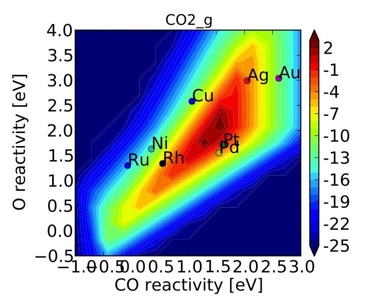
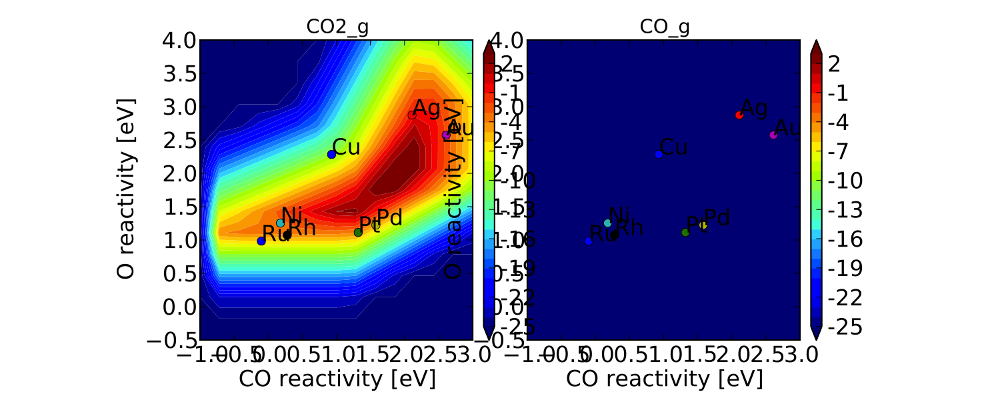
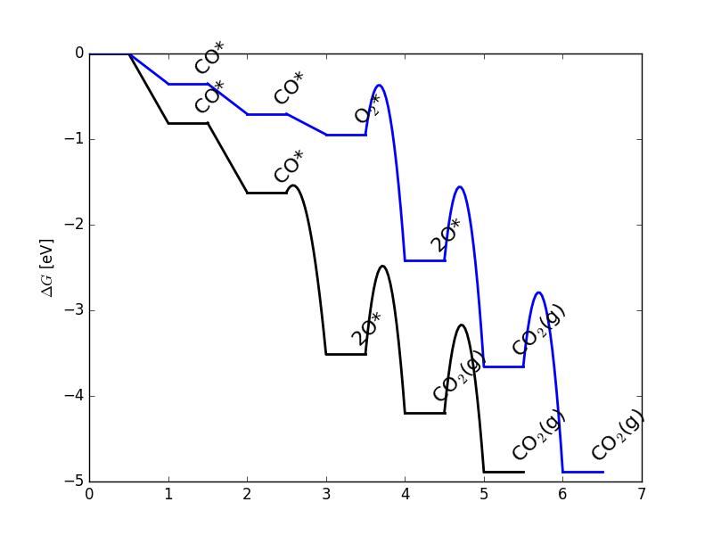
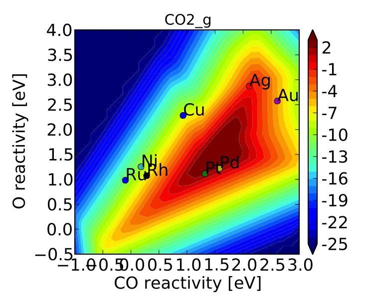

Refining a Microkinetic Model
=============================

In this tutorial we will take the simple CO oxidation model presented in
:doc:`creating_a_microkinetic_model` and refine it to be
more complete. This tutorial should show some of the more powerful
capabilities of CatMAP, and highlight the ability to dynamically make
changes to the kinetic model with minimal programming. The tutorial will
show several possibilities of ways to refine the model towards something
that correctly represents the physical system:

-  :ref:`Adding elementary steps <newsteps>` (refining the mechanism)
-  :ref:`Adding multiple sites <newsites>` (refining the active site
   structure)
-  :ref:`Sensitivity analyses <ratecontrol>` (refining the inputs to the
   model)
-  :ref:`Refining numerical accuracy <numerical>` (resolution, tolerance,
   etc.)

These sections do not need to be followed sequentially. For each one we
will start with the same setup file and input file from
:doc:`creating_a_microkinetic_model`.  We will use a slightly more efficient
submission script:

.. code:: python

    from catmap import ReactionModel

    mkm_file = 'CO_oxidation.mkm'
    model = ReactionModel(setup_file=mkm_file)
    model.output_variables += ['production_rate']
    model.run()

    from catmap import analyze
    vm = analyze.VectorMap(model)
    vm.plot_variable = 'production_rate' #tell the model which output to plot
    vm.log_scale = True #rates should be plotted on a log-scale
    vm.min = 1e-25 #minimum rate to plot
    vm.max = 1e3 #maximum rate to plot

    vm.descriptor_labels = ['CO reactivity [eV]', 'O reactivity [eV]']
    vm.threshold = 1e-25 #anything below this is considered to be 0
    vm.subplots_adjust_kwargs = {'left':0.2,'right':0.8,'bottom':0.15}
    vm.plot(save='pretty_production_rate.pdf')

.. _newsteps:

Adding Elementary Steps
~~~~~~~~~~~~~~~~~~~~~~~

One way of refining a model is to include additional steps in the
mechanism. To demonstrate this we will add molecular adsorption of
oxygen prior to dissociation. In order to do this we need to include the
relevant energetics, so add the following lines to the energies.txt:

::

    Ru  111 O2  3.15    fcc []  []  "Angew. Chem. Int. Ed., 47, 4835 (2008)"
    Rh  111 O2  3.63    fcc []  []  "Angew. Chem. Int. Ed., 47, 4835 (2008)"
    Ni  111 O2  3.76    fcc []  []  "Angew. Chem. Int. Ed., 47, 4835 (2008)"
    Pd  111 O2  4.29    fcc []  []  "Angew. Chem. Int. Ed., 47, 4835 (2008)"
    Cu  111 O2  4.52    fcc []  []  "Angew. Chem. Int. Ed., 47, 4835 (2008)"
    Pt  111 O2  4.56    fcc []  []  "Angew. Chem. Int. Ed., 47, 4835 (2008)"
    Ag  111 O2  5.1 fcc []  []  "Angew. Chem. Int. Ed., 47, 4835 (2008)"

Next, we just need to define the new elementary step in the setup file
(CO\_oxidation.mkm):

.. code:: python

    rxn_expressions = [
     
                    '*_s + CO_g -> CO*',
    #               '2*_s + O2_g <-> O-O* + *_s -> 2O*',
                    '*_s + O2_g -> O2_s',
                    '*_s + O2_s <-> O-O* + *_s -> 2O*',
                    'CO* +  O* <-> O-CO* + * -> CO2_g + 2*',
     
                        ]

Now we can run mkm\_job.py to get the output. If you run in a clean
directory you should see something like:

.. code:: python

    mapper_iteration_0: status - 225 points do not have valid solution.
    minresid_iteration_0: success - [ 3.00, 4.00] using coverages from [ 3.00, 4.00]
    minresid_iteration_0: success - [ 3.00, 3.68] using coverages from [ 3.00, 3.68]
    minresid_iteration_0: success - [ 3.00, 3.36] using coverages from [ 3.00, 3.36]
    minresid_iteration_0: success - [ 3.00, 3.04] using coverages from [ 3.00, 3.04]
    minresid_iteration_0: success - [ 3.00, 2.71] using coverages from [ 3.00, 2.71]
    ...
    minresid_iteration_1: success - [-1.00, 0.14] using coverages from [-1.00, 0.46]
    rootfinding_iteration_2: fail - stagnated or diverging (residual = 3.85907297979e-29)
    minresid_iteration_0: fail - [-1.00,-0.18] using coverages from [-1.00,-0.18]; initial residual was 8.73508143601e-21 (residual = 3.85907297979e-29)
    minresid_iteration_1: success - [-1.00,-0.18] using coverages from [-1.00, 0.14]
    minresid_iteration_0: success - [-1.00,-0.50] using coverages from [-1.00,-0.50]
    mapper_iteration_1: status - 0 points do not have valid solution.

However, if you run in the same directory that you used for
:doc:`creating_a_microkinetic_model`, you will see slightly `different output
<#initial_guess>`__. Either way, the
model should converge.

If you look at "pretty\_production\_rate.pdf" it should look like the
following:

If we compare this to the
:ref:`figure <CO2rate>` from the
previous tutorial we can see that there are a few differences, but the
general conclusions are unchanged. If we wanted to be thorough we could
continue refining the model by adding more elementary steps (`CO2
molecular adsorption, O-O-CO transition state,
etc. <http://onlinelibrary.wiley.com/doi/10.1002/anie.200801479/abstract>`__).
For brevity these extensions are omitted.

Using previous results as initial guesses
^^^^^^^^^^^^^^^^^^^^^^^^^^^^^^^^^^^^^^^^^

If you ran mkm\_job.py in the same directory as you had the
CO\_oxidation.pkl data file from :doc:`creating_a_microkinetic_model`, you might have
noticed that instead of getting output about "minresid\_iterations" you
get something like:

::

    Length of guess coverage vectors are shorter than the number of adsorbates. Assuming undefined coverages are 0
    initial_evaluation: success - initial guess at point [ 3.00, 4.00]
    Length of guess coverage vectors are shorter than the number of adsorbates. Assuming undefined coverages are 0
    initial_evaluation: success - initial guess at point [ 3.00, 3.68]
    Length of guess coverage vectors are shorter than the number of adsorbates. Assuming undefined coverages are 0
    initial_evaluation: success - initial guess at point [ 3.00, 3.36]
    ...

This happens because the model detects the data file (CO\_oxidation.pkl)
and loads in the coverages to use as an initial guess. However, it
notices that there is now more adsorbates than there are coverages since
we added O2\*. In order to make the best of this, it just assumes that
the additional coverages are 0 and uses that as an initial guess. As you
can see, it works out okay here. One thing worth noting, however, is
that since the code does not know what the order of adsorbates in the
previous model was, it cannot properly assign the coverages. Adsorbates
are parsed in the order they appear in rxn\_expressions, so in this
model the order is:

.. code:: python

    adsorbate_names = ['CO_s','O2_s','O_s']

but, before adding the new elementary step the order was of course
different (['CO\_s','O\_s']). Since there are so few adsorbates here it
turned out to be a decent initial guess that the coverage of O2\* was
equal to the coverage of O\* from the previous model, and that the
coverage of O\* was 0. In general, this will not be the case. If you
want to use initial guesses from previous models it is best to add the
new elementary steps after the old ones. Then the new adsorbates will be
assumed to have 0 coverage at the initial guess, rather than scrambling
all the coverages around. This is one of the best strategies for
obtaining convergence in very complex kinetic models: start with a
simple version of the system and slowly add more elementary steps,
converging the model along the way and using coverages from the simpler
model as an initial guess to the more complex one.

More examples of how to add elementary steps are given in the :ref:`following
section <newsites>`.

.. _newsites:

Adding multiple sites
~~~~~~~~~~~~~~~~~~~~~

Structure dependence is a common phenomenon is catalysis, so it is
important to use the correct active site structure in order to obtain
accurate kinetics. Here we will look at both the (111) and (211) facets
for CO oxidation using the previously defined model.

The first thing we will need to do is include the energetic inputs for
(211) sites:

::

    Ir  211 CO  0.673   fcc []  []  "J. Phys. Chem. C, 113 (24), 10548-10553 (2009)"
    Re  211 CO  0.753   fcc []  []  "J. Phys. Chem. C, 113 (24), 10548-10553 (2009)"
    Ru  211 CO  0.983   fcc []  []  "J. Phys. Chem. C, 113 (24), 10548-10553 (2009)"
    Rh  211 CO  1.073   fcc []  []  "J. Phys. Chem. C, 113 (24), 10548-10553 (2009)"
    Pt  211 CO  1.113   fcc []  []  "J. Phys. Chem. C, 113 (24), 10548-10553 (2009)"
    Pd  211 CO  1.223   fcc []  []  "J. Phys. Chem. C, 113 (24), 10548-10553 (2009)"
    Ni  211 CO  1.253   fcc []  []  "J. Phys. Chem. C, 113 (24), 10548-10553 (2009)"
    Co  211 CO  1.403   fcc []  []  "J. Phys. Chem. C, 113 (24), 10548-10553 (2009)"
    Fe  211 CO  1.413   fcc []  []  "J. Phys. Chem. C, 113 (24), 10548-10553 (2009)"
    Cu  211 CO  2.283   fcc []   []  "J. Phys. Chem. C, 113 (24), 10548-10553 (2009)"
    Au  211 CO  2.573   fcc []  []  "J. Phys. Chem. C, 113 (24), 10548-10553 (2009)"
    Ag  211 CO  2.873   fcc []  []  "J. Phys. Chem. C, 113 (24), 10548-10553 (2009)"
    Ru  211 O-CO    2.351   fcc []  []  "J. Phys. Chem. C, 113 (24), 10548-10553 (2009)"
    Rh  211 O-CO    2.559   fcc []  []  "J. Phys. Chem. C, 113 (24), 10548-10553 (2009)"
    Co  211 O-CO    2.732   fcc []  []  "J. Phys. Chem. C, 113 (24), 10548-10553 (2009)"
    Ni  211 O-CO    2.768   fcc []  []  "J. Phys. Chem. C, 113 (24), 10548-10553 (2009)"
    Pt  211 O-CO    3.528   fcc []  []  "J. Phys. Chem. C, 113 (24), 10548-10553 (2009)"
    Cu  211 O-CO    3.918   fcc []  []  "J. Phys. Chem. C, 113 (24), 10548-10553 (2009)"
    Pd  211 O-CO    3.992   fcc []  []  "J. Phys. Chem. C, 113 (24), 10548-10553 (2009)"
    Ag  211 O-CO    5.099   fcc []  []  "J. Phys. Chem. C, 113 (24), 10548-10553 (2009)"
    Au  211 O-CO    5.448   fcc []  []  "J. Phys. Chem. C, 113 (24), 10548-10553 (2009)"
    Ag  211 O-O 5.34    fcc []  []  Falsig et al (2012)
    Au  211 O-O 6.18    fcc []  []  Falsig et al (2012)
    Pt  211 O-O 4.9 fcc []  []  Falsig et al (2012)
    Pd  211 O-O 4.6 fcc []  []  Falsig et al (2012)
    Re  211 O   -1.5    fcc []  []  Falsig et al (2012)
    Co  211 O   -0.15   fcc []  []  Falsig et al (2012)
    Ru  211 O   -0.1    fcc []  []  Falsig et al (2012)
    Ni  211 O   0.18    fcc []  []  Falsig et al (2012)
    Rh  211 O   0.28    fcc []  []  Falsig et al (2012)
    Cu  211 O   0.93    fcc [] []  Falsig et al (2012)
    Pt  211 O   1.32    fcc []  []  Falsig et al (2012)
    Pd  211 O   1.58    fcc []  []  Falsig et al (2012)
    Ag  211 O   2.11    fcc []  []  Falsig et al (2012)
    Au  211 O   2.61    fcc []  []  Falsig et al (2012)
    Fe  211 O   -0.73   fcc []  []  "Phys. Rev. Lett. 99, 016105 (2007)"
    Ir  211 O   -0.04   fcc []  []  "Phys. Rev. Lett. 99, 016105 (2007)"

We note that there is no data readily available for molecular O2
adsorption on the (211) facet, so we need to make sure we move back to
the simpler model from :doc:`creating_a_microkinetic_model` for the (211)
analysis:

.. code:: python

    rxn_expressions = [ 

                   '*_s + CO_g -> CO*', 
                   '2*_s + O2_g <-> O-O* + *_s -> 2O*',
    #               '*_s + O2_g -> O2_s',
    #               '*_s + O2_s <-> O-O* + *_s -> 2O*',
                   'CO* +  O* <-> O-CO* + * -> CO2_g + 2*',

                       ]   

If we check the "pretty\_production\_rate.pdf" then we see the
following:

which is not very pretty. The plot on the right is showing up because the
plotter says it is not empty; however, as you can see it looks pretty
empty. This is happening because of numerical issues - there are some
very small (<1e-50 - the tolerance) positive values for production of CO
at some points in descriptor space. The quick way to get rid of this is
to set a "threshold" for the plotter, so that it counts very small
values as 0:

.. code:: python

    vm.descriptor_labels = ['CO reactivity [eV]', 'O reactivity [eV]']
    vm.threshold = 1e-25
    vm.subplots_adjust_kwargs = {'left':0.2,'right':0.8,'bottom':0.15}
    vm.plot(save='pretty_production_rate.pdf')

Now we get the following:

.. figure:: ../_static/3_211_pretty_production_rate.png
  :align: center

The same thing can also be achieved by tightening the numerical
precision/tolerance, as discussed :ref:`later <numerical>`. When we look
at the plot we see the leg going out towards Ni/Ru/Rh which, based on
the :ref:`previous section <newsteps>`, we can predict will be reduced if
molecular oxygen adsorption is considered. We also notice that the
maximum is moved towards the nobler metals, which is roughly consistent
with the findings of `Falsig et.
al. <http://onlinelibrary.wiley.com/doi/10.1002/anie.200801479/abstract>`__
who show that nobler metals are more active when undercoordinated
clusters are examined.

Of course in a real catalyst, there will be both (111) and (211) facets
(along with lots of others, but lets focus on these two for now). We can
use CatMAP to examine both facets simultaneously by adding new sites.
First, we need to define the mechanisms on both sites:

.. code:: python

    rxn_expressions = [

                   '\*_s + CO_g -> CO*', 
                   '2*_s + O2_g <-> O-O* + \*_s -> 2O*',
    #               '\*_s + O2_g -> O2_s',
    #               '\*_s + O2_s <-> O-O* + \*_s -> 2O*',
                   'CO* +  O* <-> O-CO* + * -> CO2_g + 2*',

                   '\*_t + CO_g -> CO_t',
    #               '2*_t + O2_g <-> O-O* + \*_t -> 2O*',
                   '\*_t + O2_g -> O2_t',
                   '\*_t + O2_t <-> O-O_t + \*_t -> 2O_t',
                   'CO_t +  O_t <-> O-CO_t + \*_t -> CO2_g + 2*_t',

                   '\*_t + CO_s -> CO_t + \*_s',
                   '\*_t + O_s -> O_t + \*_s',

                       ]

Here we use \_s (or just \* which is equivalent to \_s) to denote step
sites, and \_t to denote terrace sites. We have included molecular
oxygen adsorption on the terrace, but not the step since we don't have
the energetics. Diffusion between the step and terrace sites are also
included, and they have no activation barrier which implies that there
should be equilibrium between CO\* and O\* on the step/terrace. In
addition to the new elementary steps, we also need to include this new
"terrace site" in the species definitions:

.. code:: python

    species_definitions['s'] = {'site_names': ['211'], 'total':0.05} #define the sites
    species_definitions['t'] = {'site_names': ['111'], 'total':0.95} 

We also need to decide whether we want to use the (111) or (211)
adsorption energies as descriptors. The proper way to do this would be
to check the quality of the scaling relations and see which shows a
better correlation to the parameters. However, lets just stick with the
(211) sites for now.

Here we have assumed that there are 5% step sites, and 95% terrace
sites. Now we can run mkm\_job.py, and after a lot of fussing the model
should converge. The new output looks like:

.. figure:: ../_static/3_dual_pretty_production_rate.png
  :align: center

which clearly shows Pt and Pd as the best CO oxidation catalysts (as we
would expect). It is a little worrying that Ag is predicted to be better
than Rh, but this could be due to neglecting some mechanism (e.g.
O-O-CO), neglecting zero-point and free energy contributions for
adsorbates, lack of adsorbate-adsorbate interactions, or issues with the
DFT input energies.

.. _fed:

Free Energy Diagrams
~~~~~~~~~~~~~~~~~~~~

A common way to evaluate or diagnose simpler microkinetic models is to examine
the free energy diagrams that went into its creation.  In the setup file, we
can define any number of reaction mechanisms like the following:

.. code:: python

    rxn_mechanisms = {  # these are 1-indexed
       "steps": [1, 1, 2, 3, 3],
       "terraces": [4, 4, 5, 6, 7, 7],
    }

Here we have defined two reaction mechanisms that follow the catalytic cycle
of CO oxidation on steps and terraces.  The array for each mechanism is composed
of the 1-indexed reaction numbers as described in :code:`rxn_expressions`.  You
can use the reverse of a given elementary step by prepending the index with a
negative sign.

To actually plot the free energy diagrams, we add the following lines to mkm\_job.py:

.. code:: python

    ...
    ma = analyze.MechanismAnalysis(model)
    ma.energy_type = 'free_energy' #can also be free_energy/potential_energy
    ma.include_labels = False #way too messy with labels
    ma.pressure_correction = False #assume all pressures are 1 bar (so that energies are the same as from DFT)
    ma.include_labels = True
    fig = ma.plot(plot_variants=['Pt'], save='FED.png')
    print(ma.data_dict)  # contains [energies, barriers] for each rxn_mechanism defined
    ...

This uses CatMAP's built-in automatic plotter to generate free energy diagrams for your
defined reaction mechanisms on all surfaces by default.  For clarity, we are choosing
to only plot a subset of these surfaces with the :code:`plot_variants=['Pt']` keyword
argument.  For electrochemical systems using ThermodynamicScaler, plot\_variants instead
refers to an array of voltages at which to plot free energy diagrams.  The resulting plot
is fairly simplistic, but feel free to generate your own nicer-looking free energy diagrams
using the dictionary provided in :code:`ma.data_dict`, which stores the values of
free energies and barriers for each defined reaction mechanism.

The resulting free energy diagram is a good way to quickly determine if the results of your
microkinetic model match with your expectations from its free energy inputs.

.. _ratecontrol:

Sensitivity Analyses
~~~~~~~~~~~~~~~~~~~~

Of course the kinetic models we are building follow the golden rule of
mathematical modeling: garbage in, garbage out (i.e. your model is only
as good as its inputs). Even if you have the correct mechanism and
active site configuration, the results will not make sense if the data
in the energy tables is inaccurate. However, in order to refine these
inputs it is often useful to know which ones are most important. This
can be analyzed using sensitivity analyses.

Rate Control
^^^^^^^^^^^^

The degree of rate control is a powerful concept in analyzing reaction
pathways. Although many varieties exist, the version published by
`Stegelmann and
Campbell <http://pubs.acs.org/doi/abs/10.1021/ja9000097>`__ is the most
general and is implemented in the micro-kinetics module. In this
definition we have:

:math:`X_{ij} = \frac{\mathrm{d} \log(r_i)}{\mathrm{d} (-G_j/kT)}`

where :math:`X_{ij}` is the degree of rate control matrix, :math:`r_i` is the rate of
production for product *i*, :math:`G_j` is the free energy of species *j*, *k* is
Boltzmann's constant, and *T* is the temperature. A positive degree of
rate control implies that the rate will increase by making the species
more stable, while a negative degree of rate control implies the
opposite.

In order to get the degree of rate control we need to add it as an
output\_variable in mkm\_job.py:

.. code:: python

    ...
    mkm_file = 'CO_oxidation.mkm'
    model = ReactionModel(setup_file=mkm_file)
    model.output_variables += ['production_rate','rate_control']
    model.run()
    ...

We also want to make a plot to visualize the degree of rate control:

.. code:: python

    mm = analyze.MatrixMap(model)
    mm.plot_variable = 'rate_control'
    mm.log_scale = False
    mm.min = -2
    mm.max = 2
    mm.plot(save='rate_control.pdf')

The MatrixMap class is very similar to the VectorMap, except that it is
designed to handle outputs which are 2-dimensional. This is true of the
rate\_control (and most other sensitivity analyses) since it will have a
degree of rate control for each gas product/intermediate species pair.
We set the min/max to -2/2 here since we know that degree of rate
control is of order 1. In fact it is bounded by the number of times an
intermediate appears on the same side of an elementary step. In this
case that is 2, since O2\* → 2O\* (O\* appears twice on the RHS). We
could also just let the plotter decide the min/max automatically, but
this is sometimes problematic due to :ref:`numerical issues with rate
control <sensitivity_numerics>`.

Now we can run the code. You should see that the initial guesses are
proving successful for each point, but you will probably notice that the
code is executing significantly slower (factor of ~16). The reason for
this will be discussed :ref:`later <sensitivity_numerics>`. Unlike
rates/coverages, the rate control will not converge quicker with a
previous solution as an initial guess. In this case it may be desirable
to load in the results of a previous simulation directly like:

.. code:: python

    mkm_file = 'CO_oxidation.mkm'
    #model = ReactionModel(setup_file=mkm_file)
    #model.output_variables += ['production_rate','rate_control']
    #model.run()

    model = ReactionModel(setup_file=mkm_file.replace('mkm','log'))

In general this is a good way to re-load the results of a simulation
without recalculating it. Regardless, the rate control plot looks like:

.. !rate\_control.pdf\|height=850, width=1100!
.. figure:: ../_static/3_rate_control.png
  :align: center

This shows us that the rate is decreased when O\* or CO\* are bound more
strongly (depending on descriptor values). Conversely, the rate can be
increased by lowering the energy of the O-CO transition state, or
sometimes by binding O\* more strongly at the (211) site. The effect of
lowering the O-O transition-state varies depending on where the surface
is in descriptor space.

While these types of analyses are useful, they should be used with
caution. If the energies of other intermediates change considerably then
it could result in those intermediates controlling the rate.
Furthermore, as discussed by `Nørskov et.
al <http://www.sciencemag.org/content/324/5935/1655>`__, there are
underlying correlations beneath the parameters, so if one wants to
optimize a catalyst these must also be considered.

Other Sensitivity Analyses
^^^^^^^^^^^^^^^^^^^^^^^^^^

Similar to the degree of rate control, the degree of selectivity control
can also be defined:

:math:`X^S_{ij} = \frac{\mathrm{d}\log(s_i)}{\mathrm{d}(-G_j/kT)}`

where :math:`X^S_{ij}` is the degree of selectivity control, and :math:`s_i` is the
selectivity towards species *i*. This can be included analogously to
rate control by adding 'selectivity\_control' to the output variables
and analyzing with the MatrixMap class.

There is also the reaction order with respect to external pressures of
various gasses, given mathematically by:

:math:`R_{ij} = \frac{\mathrm{d} \log(r_i)}{\mathrm{d} \log(pj)}`

where :math:`p_j` is the pressure of gas species *j*. This can also be included
in the same way as rate\_control and selectivity control by including
"rxn\_order" in the output variables.

.. _sensitivity_numerics:

Numerical Issues in Sensitivity Analyses
^^^^^^^^^^^^^^^^^^^^^^^^^^^^^^^^^^^^^^^^

All sensitivity analyses implemented in the micro-kinetics module are
calculated via numerical differentiation. This causes them to be very
slow. Furthermore, the fact that numerical differentiation is
notoriously sensitive to the "infinitesimal" number used to calculate
the derivative, combined with the extreme stiffness of the sets of
differential equations behind the kinetic model, can lead to issues. The
two most common are:

Jacobian Errors
'''''''''''''''

You may sometimes notice that the model will give output like:

::

    initial_evaluation: success - initial guess at point [ 2.71, 3.36]
    rootfinding_iteration_3: fail - stagnated or diverging (residual = 5.22501330063e-13)
    jacobian_evaluation: fail - stagnated or diverging (residual = 5.22501330063e-13). Assuming Jacobian is 0.
    initial_evaluation: success - initial guess at point [ 2.71, 3.04]

This implies that the coverages for the unperturbed parameters failed
when used as an initial guess for the perturbed parameters. Given that
the perturbation size is, by default, 1e-14, this should only happen if
the system is extremely stiff. However, its not impossible. Usually you
can figure out what you need to know even when you skip the points where
the Jacobian fails, but in the case you really need it converged at
every point, you can decrease the "perturbation\_size" attribute of the
reaction model. When specifying perturbations below 1e-14 it is probably
a good idea to do this using the multiple-precision representation as:

.. code:: python

    model.perturbation_size = model._mpfloat(1e-16)

Diverging or Erroneous sensitivities
''''''''''''''''''''''''''''''''''''

It is also not uncommon for the sensitivities to diverge to extremely
large numbers, or just appear to be random numbers. This generally
happens if the perturbation size is too small so that there is no
measurable change in the values of the function. The best thing to do
here is to tune the perturbation size to a slightly larger number and
hope for convergence. Sometimes this does not work, in which case it
might also be necessary to increase the precision and decrease the
tolerance of the model by many orders of magnitude (see :ref:`Refining
Numerical Accuracy <numerical>`).

.. _numerical:

Refining Numerical Accuracy
~~~~~~~~~~~~~~~~~~~~~~~~~~~

A final way to refine a kinetic model is via changing the numerical
parameters used for convergence, etc. A few of these parameters will be
briefly discussed here:

resolution
^^^^^^^^^^

The resolution determines the number of points between the min/max of
the descriptor space. It can be a single number (same resolution in both
directions) or a list the length of the number of descriptors. The
latter case allows taking a higher resolution in one dimension vs. the
other, which is useful if the descriptors have very different scales. It
is also worth mentioning that a single-point calculation can be done by
setting the resolution to 1. It is important to find a resolution that
is fine enough to capture all the features in descriptor space, but of
course higher resolution requires more time. It is also worth mentioning
that if you want to refine the resolution it is good to pick a number
like 2\*old\_resolution - 1 since this allows you to re-use all the
points from the previous solution.

The CO oxidation volcano is shown below at a resolution of 29 (as
opposed to 15):

It looks nicer, but doesn't give much new insight.

decimal\_precision
^^^^^^^^^^^^^^^^^^

This parameter represents the numerical accuracy of the kinetic model.
The solutions are found using a multiple-precision representation of
numbers, so it is possible to check them to "arbitrary accuracy". Of
course the model will run slower as the decimal\_precision is increased,
but if the precision is not high enough then the results will not make
sense. Generally a decimal\_precision of ~100 is sufficient, but for
complex models, or when the sensitivity analyses do not behave well, the
decimal\_precision sometimes needs to be increased upwards of 200-300
digits. If the solutions are correct it should be possible to increase
this number arbitrarily and continue to quickly refine the precision of
the solutions.

tolerance
^^^^^^^^^

The tolerance is the maximum rate which is considered 0 by the model.
Thus the tolerance should be set to several orders of magnitude below
the lowest rate which is relevant for the model. Usually something on
the order of 1e-50 to 1e-35 is sufficient. However, when dealing with a
model where the maximum rate is very low, or when trying to make
sensitivity analyses more accurate, it may be necessary to decrease the
tolerance to as low as 1e-decimal\_precision. Similar to the
decimal\_precision, if the solutions are correct then it should be
possible to arbitrarily decrease the tolerance (although it should never
be lower than 1e-decimal\_precision).

max\_rootfinding\_iterations
^^^^^^^^^^^^^^^^^^^^^^^^^^^^

This determines the maximum number of times the Newton's method
rootfinding algorithm can iterate. It is generally safe to set this to a
very high number, since if the algorithm begins to diverge (or even
stops converging) then it will automatically exit. Usually a number
around 100-300 is practical. This parameter does not affect the
solutions of the model, just if/how long the model takes to converge.

max\_bisections
^^^^^^^^^^^^^^^

This determines the number of times a distance between two points in
descriptor space can be "bisected" when looking for a new solution. For
example, if we know the solution at (0,0) and want the solution at (0,1)
the first thing to try is using the (0,0) solution as an initial guess.
If that fails, the line will be bisected, and the (0,0) solutions will
be tried at (0,0.5). If this fails, then (0,0.25) is tried. This
continues a maximum of max\_bisections times before the module gives up.
This is a "desperation" parameter since it is the best way to get a
model to converge, but can be very slow. It is best to start with a
value of 0-3, and then slowly increase until the algorithm can find a
solution at all points. If the number goes above ~6 then it is an
indication that there is something fundamentally wrong with the
convergence critera (i.e. the solution oscillates) and that there is no
steady-state solution.

Like :code:`max_rootfinding_iterations`, :code:`max_bisections` will not change the
overall answers to the model, but will determine if/how long it takes to
converge.
